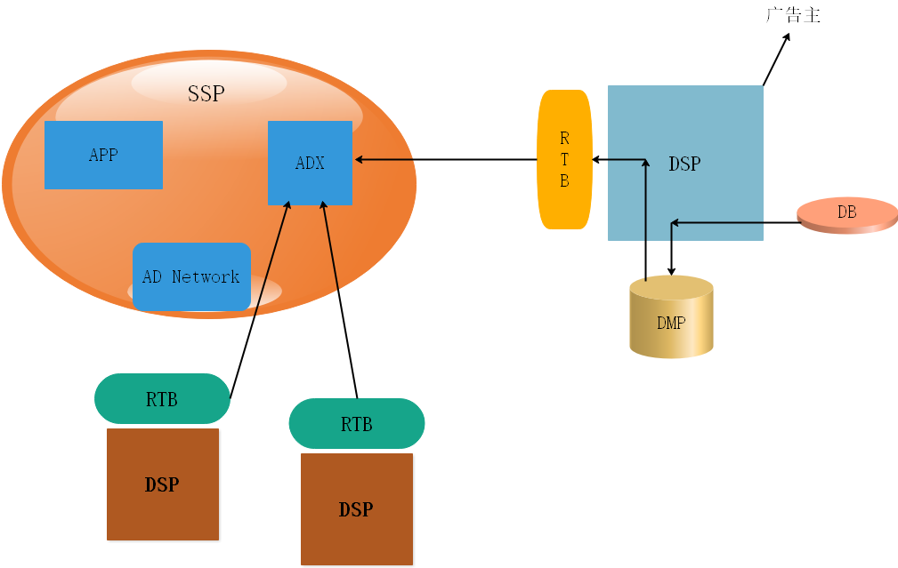
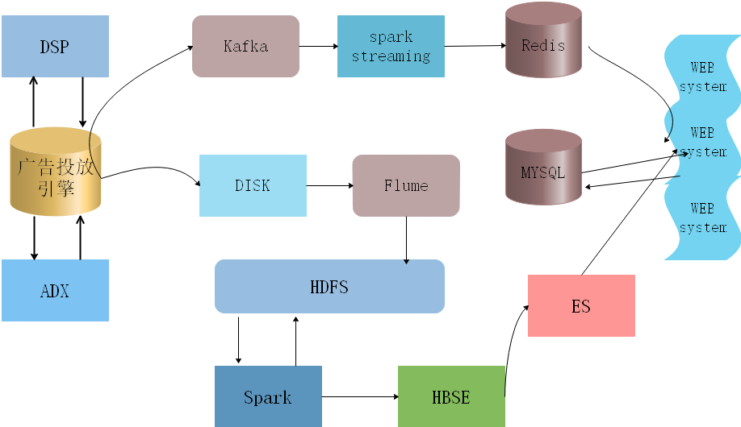

# Project-dmp
a data-management-plains project

互联网广告投放平台_用户画像(data-management-plains)工程:  

DMP优点:做精准广告推送.1，dmp平台，收集用户产生的日志，对日志进行分析，进行数据分析与挖掘，分析出这些人的特征打上相应的标签，继而服务于dsp平台，达到精准广告推送。如图所示。  
数据量:每天2000-3000万笔，每条数据0.5KB左右，大概15GB左右。  
广告报表:  
——地域  
——渠道  
——媒体  
——设备类型  
——联网方式  
——运营商  
指标:  
——原始请求，有效请求，广告请求，参与竞价数，竞价成功数，展示量，点击量，消费，成本。  

dmp标签最终保存形式:parque(列存储)  
a，可以跳过不符合条件的数据，只读取需要的列，能获得更好的扫描性。  
b，压缩编码可以降低磁盘空间。  
c，适用于多种计算框架。   

用户画像流程:  
原始文件有了，知识库包括标签体系，字典文件；最终打成标签即为用户画像。  

软件版本:  
hadoop 2.7  
hive 1.2  
zookeeper 3.4  
spark 1.6  
hbase 0.98  
scala 2.10  
flume 1.5  
kafka 1.0  
elasticsearch 2.3  
每个local文件大约代码50-100行。  

项目生成环境:  
集群-8台  
40核，120G内存  

数据量:  
200-300G，采用GZIP压缩，每天读取150-250G.  

